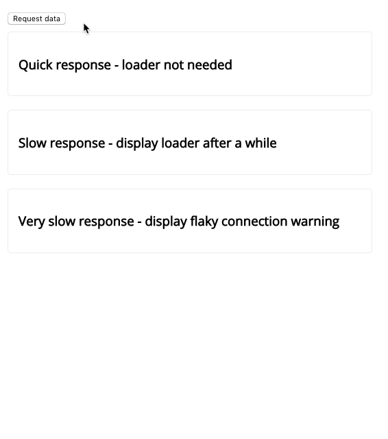

# ngx-deferred-loader

Defer displaying loading placeholders until given period of time passes.



## What problem does it solve

It solves two very common problems of apps relying on async calls:
* blinking loading placeholders in case of quick responses from back-end
* lack of feedback in case of long running requests

Using `ngx-loading-placeholder` you can defer displaying loaders for given period of time.

## How to

Import required module into your Angular app:

```ts
import { DeferredLoaderModule } from '@psmyrdek/ngx-deferred-loader';

@NgModule({
  ...
  imports: [
    DeferredLoaderModule
  ]
  ...
})
export class AppModule { }
```

Apply `*deferredLoader` directive to one of your loading placeholders, passing observable as an argument.

```html
<p *deferredLoader="todoList$; waitMs:300">Please check your network connection...</p>
<ul>
    <li *ngFor="let todo of todoList$ | async">
        {{ todo.name }}
    </li>
</ul>
```

In above case the loading placeholder will be displayed only if request takes more than 300ms, and will be hidden once observable is completed.

## Configuration

* `*deferredLoader` - expects a parameter of type `Observable<any>`
* `waitMs` (optional) - defines period of time after which the loading placeholder is displayed (default - `200ms`)